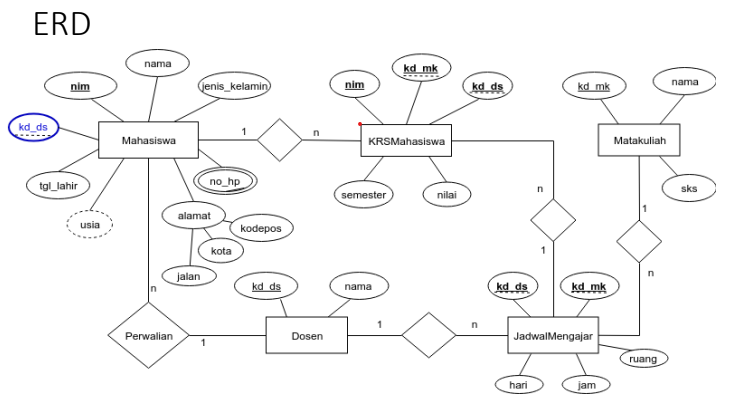
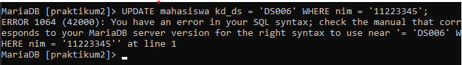
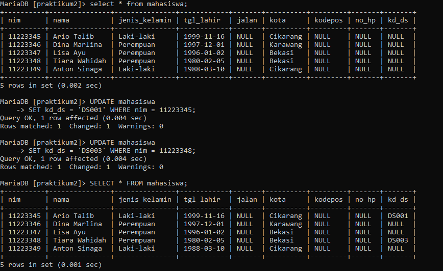
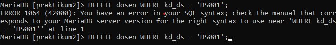
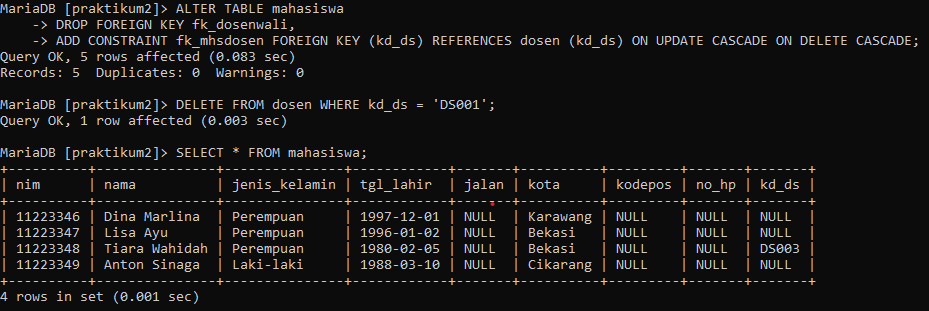
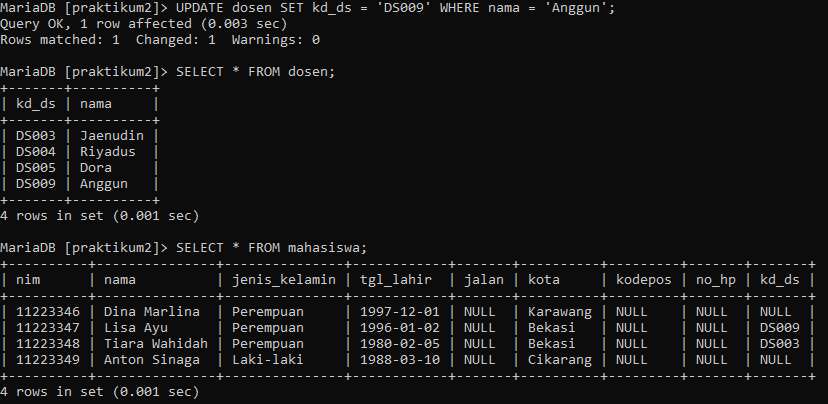
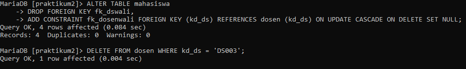

# Praktikum3_SQL

## **CONSTRAINT FOREIGN KEY**
      
Implementasikan penggunaan **CONSTRAINT FOREIGN KEY** pada semua tabel yang berelasi.            

### **A. Script DDL & DML**
1. **DDL *Script***     
    Data definition Language (DDL) adalah bahasa pemrogaraman yang digunakan untuk mengola objek database, seperti tabel, indeks, dan constraint. DDL digunakan untuk membuat, mengubah dan menghapus struktur database, termasuk tabel, kolom, kunci utama, indeks dan tampilan.       
    Berikut adalah perintah-perintah DDL yang digunakan untuk membuat sebuah DBMS berdasarkan skema diatas.
    - Membuat sebuah database: 
        ```sql
        CREATE DATABASE nama_database;
        ```
    - Menggunakan database:
        ```sql
        USE nama_database;
        ```
    - Membuat sebuah tabel:
        ```sql
        CREATE TABLE nama_tabel (field1,...,fieldn) VALUE
        (value1 tipe_data(ukuran),...,
        (valuen tipe_data(ukuran))
        );
        ```
    - Menambah PRIMARY KEY:
        ```sql
        ALTER TABLE nama_tabel ADD PRIMARY KEY (nama_field)
        ```
    - Menambah CONSTRAINT FOREIGN KEY:
        ```sql
        ALTER TABLE nama_tabel ADD CONSTRAINT nama_constraint
        FOREIGN KEY (nama_field) REFERENCES nama_tabel_referensi(nama_field_referensi)
        ```
    - Menambah AUTO INCREMENT:
        ```sql
        ALTER TABLE nama_tabel MODIFY nama_field tipe_data(ukuran) AUTO_INCREMENT;
        ```
2. **DML *Script***
    Data Manipulation Language (DML) adalah bahasa yang digunakan untuk mengakses, memanipulasi, dan mengubah data dalam database.
    Berikut adalah perintah-perintah DML yang digunakan untuk membuat sebuah DMS berdasarkan skema diatas.
    - Menambah data:
        ```sql
        INSERT INTO <table_name> (filed1,...,fieldn) VALUE (val1,...,valn);
        ```
    - Mengubah data:
        ```sql
        UPDATE <table_name> SET [field1=val1,..,fieldn=valn] WHERE <kondisi>
        ```
    - Menghapus data: 
        ```sql
        DELETE FROM <table_name> WHERE <kondisi>
        ```
    - Menampilkan data:
        ```sql
        SELECT * FROM <table_name>
        ```
    - Menampilkan data sesuai kondisi:
        ```sql
        SELECT * FROM <table_name> WHERE <kondisi>
        ```
        Selisih tahun
        ```sql
        SELECT * FROM <table_name> WHERE TIMESTAMPDIFF (YEAR, tgl_lahir, CURDATE()) < usia
        ```
        Sesuai urutan
        ```sql
        SELECT * FROM <table_name>  WHERE ORDER BY <acuan>
        ```
        sesuai field/kolom yang diinginkan
        ```sql
        SELECT <field1,...,fieldn> FROM <nama_tabel>;
        ```

####  **B. Langkah-langkah Praktikum**

1. Lakukan penambahan data pada table mahasiswa dengan mengisi kd_ds yang belum ada pada data dosen.

    ```sql
    UPDATE mahasiswa
    SET kd_ds = 'DS011' WHERE nim = 112233445;
    ```

    **Contoh:**
    <br>
    <br>

2. Hapus satu record data pada table dosen yang telah dirujuk pada tabel mahasiswa.

    ```sql
    DELETE FROM dosen WHERE kd_ds = 'DS001';
    ```

    **Contoh:**
    <br>

3. Ubah mode menjadi ON UPDATE CASCADE ON DELETE RESTRICT

    ```sql
    ALTER TABLE mahasiswa
    DROP FOREIGN KEY fk_mahasiswa_dosen,
    ADD CONSTRAINT fk_dosenwali FOREIGN KEY (kd_ds) REFERENCES dosen(kd_ds) ON UPDATE CASCADE ON DELETE CASCADE;
    ```

    ```sql
    ALTER TABLE mahasiswa
    DROP FOREIGN KEY fk_mahasiswa_dosen,
    ADD CONSTRAINT fk_dosenwali FOREIGN KEY (kd_ds) REFERENCES dosen(kd_ds) ON UPDATE CASCADE ON DELETE RESTRICT;
    ```

    **Contoh:**
    <br>

4. Lakukan perubahan data pada tabel dosen.

    ```sql
    UPDATE dosen
    SET kd_ds = 'DS003' WHERE nama = 'Usop';
    ```

    **Contoh:**
    <br>

5. Lakukan penghapusan data pada tabel dosen (kd_ds). Ubah mode menjadi ON UPDATE CASCADE ON DELETE SET NULL.

    ```sql
    ALTER TABLE mahasiswa
    DROP FOREIGN KEY fk_mahasiswa_dosen,
    ADD CONSTRAINT fk_dosenwali FOREIGN KEY (kd_ds) REFERENCES dosen(kd_ds) ON UPDATE CASCADE ON DELETE RESTRICT;
    ```

    ```sql
    ALTER TABLE mahasiswa
    DROP FOREIGN KEY fk_mahasiswa_dosen,
    ADD CONSTRAINT fk_dosenwali FOREIGN KEY (kd_ds) REFERENCES dosen(kd_ds) ON UPDATE CASCADE ON DELETE NOT NULL;
    ```

    ```sql
    DELETE FROM dosen WHERE nim = 'DS003';
    ```

    **Contoh:**
    <br>


# FINISH